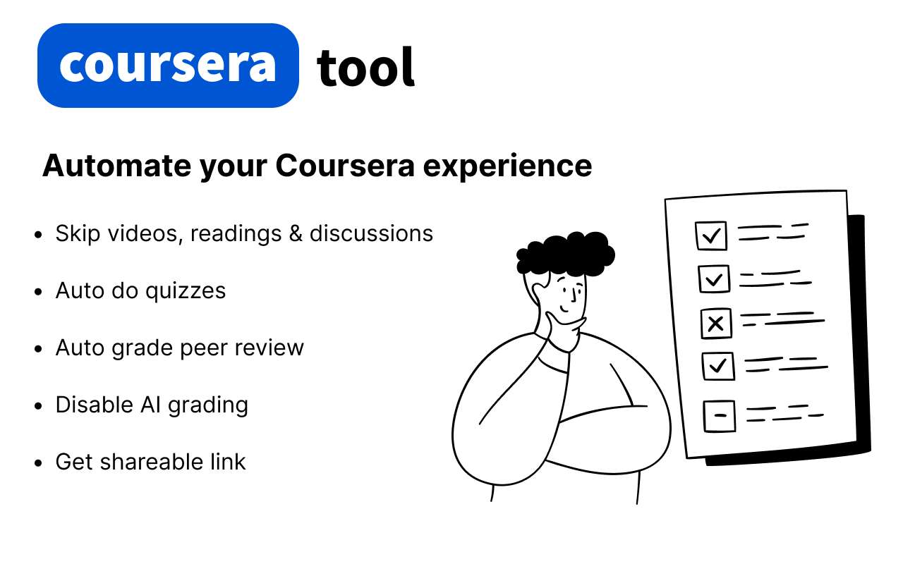
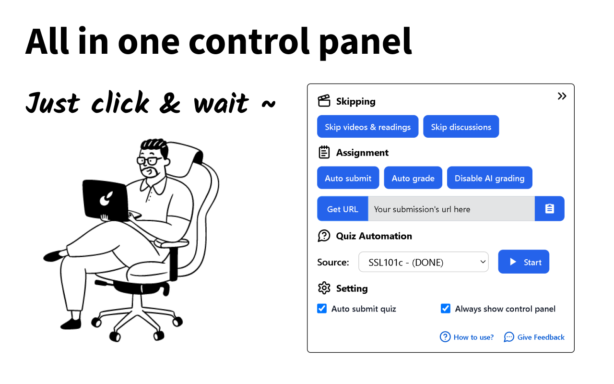
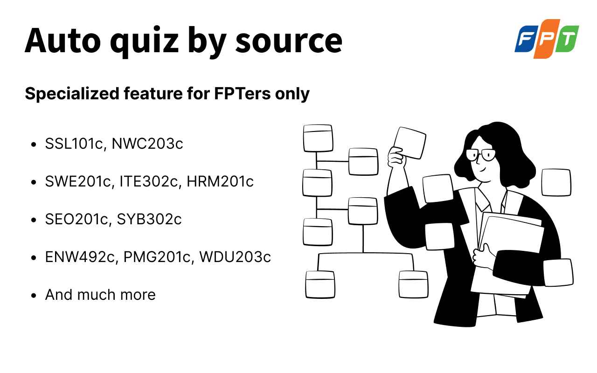

# 🎓 Coursera Tool Extension

A small helper for Coursera learners — designed **for educational purposes only**.

> ⚠️ _Don’t misuse this for official work or certificates. Do it by yourselk if it really matters._

## 🚀 Features

- 📑 **Auto-complete** all videos and reading sections
- 💯 **Gemini Auto-answer** quizzes _(WIP – may not be 100% accurate)_
- 🧑 **Auto-submit** peer-graded assignments _(Some time doesn't work)_
- 📋 **One-click** copy of your submission link
- ✅ **Auto-grade** the highest score for peer submissions
- 🤖 **Switch** your submission from AI grading to peer grading

> ⚠️ **Caution:** Auto-quiz feature might not always provide the correct answers and Auto-submit feature might not always work.

## 📦 Installation

### 🧩 Option 1: Install from Browser Add-ons

- [Edge Add-ons Store](https://microsoftedge.microsoft.com/addons/detail/coursera-toolkit-helper/cpebdnelbbfbnjbdafkkcgbbgbdbhhgb)
- [Firefox Add-ons Store](https://addons.mozilla.org/en-GB/firefox/addon/coursera-tool/)

> ❌ _Chrome Web Store is not supported due to Chrome's policy restrictions._  
> ✅ _Use manual installation for Chrome (see below)._

### 🛠 Option 2: Manual Installation via GitHub

1. Download the latest `build.zip` from the [Releases Page](https://github.com/Pear104/coursera-tool/releases)
2. Extract the contents
3. Open Chrome and navigate to [Chrome Extension Manager](chrome://extensions/)
4. Enable **Developer Mode** (top-right toggle)
5. Click **"Load unpacked"**
6. Select the extracted folder

📘 Need more help? Check out this [step-by-step guide](https://ui.vision/howto/install-chrome-extension-from-file)

## 🖼 Preview

## 😱 Feature For FPTers only

## ☕ Support

This extension is **100% free**. If you find it useful and want to support the project:

- ⭐ Star the repository
- 💬 Leave a feedback
- [☕ Buy me a coffee](https://buymeacoffee.com/pear104)

> Every kind gesture, whether a coffee or a kind comment, keeps this project alive and evolving. Thank you!

## 🐞 Report an Issue

If you encounter a bug, have a suggestion, or want to request a new feature, please open an issue on GitHub or DM [me](https://www.facebook.com/profile.php?id=100074006097767)

---

_Made with ❤️ from FPT_
