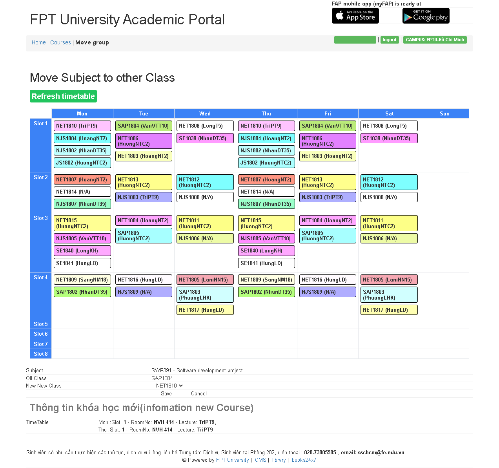

# coursera-link-getter

Chrome extension for getting your coursera assignment link

## Demo

<!--  -->

## Installation

- Step 1: Download repository
- Step 2: Unzip the packed file
- Step 3: Go to chrome extension manager
- Step 4: Turn on "Developer mode"
- Step 5: Click "Load unpacked" button
- Step 6: Choose "dist" folder in the extracted folder

## Note

- Discourage to use in the rush hour
